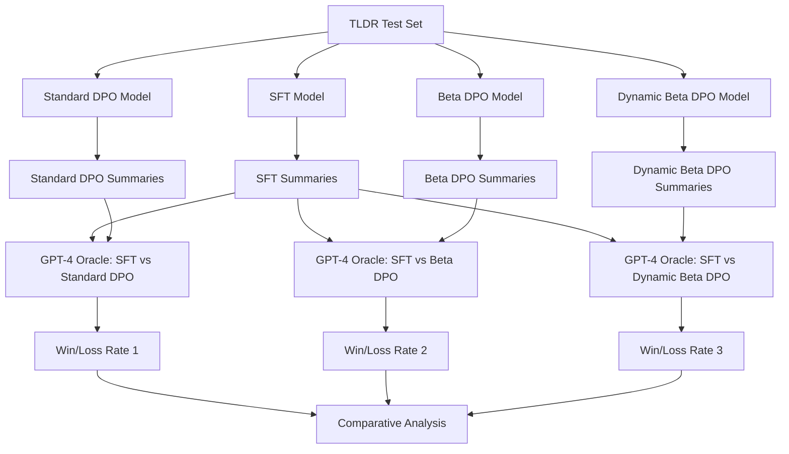

# GPT-4 Oracle Evaluation Implementation Plan

## Overview

This document outlines the implementation plan for evaluating DPO training methods using GPT-4 as an external oracle. The evaluation compares an SFT (Supervised Fine-Tuning) baseline model against three DPO variants on the **TLDR dataset** (`trl-lib/tldr`) for summarization tasks.

### Evaluation Objective

Measure the quality improvement of DPO-trained models over the SFT baseline by having GPT-4 judge which summary better captures the most important points of forum posts.

### Model Comparisons (3 Pairs)

1. **SFT vs. Standard DPO** - Baseline DPO with fixed beta
2. **SFT vs. Beta DPO** - DPO with adaptive beta (no risk control)
3. **SFT vs. Dynamic Beta DPO** - Your method with risk-controlled dynamic beta

### Success Metric

**Win/Loss Rate**: Percentage of times the DPO model's summary is preferred over the SFT model's summary by GPT-4.

---

## Background: TLDR Dataset

The **TL;DR dataset** contains:
- Reddit forum posts (long-form text)
- Human-written summaries
- Preference pairs (chosen vs. rejected summaries)

**Dataset Source**: `trl-lib/tldr`

**Task**: Generate concise summaries that capture the most important points of forum posts.

---

## Architecture Overview



---

## Implementation Plan

### Phase 1: Dataset Preparation

#### Step 1.1: Load TLDR Test Set

Create a script to load and prepare the TLDR evaluation dataset.

**File**: `test/gpt_judge/data_process_tldr.py`

**Key Functions**:
- Load TLDR dataset from HuggingFace (`trl-lib/tldr`)
- Extract test split (or create held-out evaluation set)
- Format data as `{post, reference_summary}` pairs
- Sample a manageable evaluation size (e.g., 500-1000 examples)

**Data Schema**:
```python
{
    "post": "Original Reddit post text...",
    "reference_summary": "Human-written summary...",
    "post_id": "unique_identifier"
}
```

#### Step 1.2: Dataset Statistics

Track and log:
- Number of evaluation examples
- Average post length
- Average summary length
- Post categories/subreddits (if available)

---

### Phase 2: Model Output Generation

#### Step 2.1: Generate Summaries from All Models

Create a unified generation script that produces summaries from all four models.

**File**: `test/gpt_judge/generate_summaries.py`

**Functionality**:
- Load each model (SFT, Standard DPO, Beta DPO, Dynamic Beta DPO)
- Generate summaries for all test examples
- Save outputs in structured format
- Support batch processing for efficiency

**Output Format** (JSON):
```json
{
    "post_id": "abc123",
    "post": "Original post text...",
    "reference_summary": "Human summary...",
    "sft_summary": "SFT model summary...",
    "standard_dpo_summary": "Standard DPO summary...",
    "beta_dpo_summary": "Beta DPO summary...",
    "dynamic_beta_dpo_summary": "Dynamic beta DPO summary..."
}
```

**Configuration Parameters**:
- Model paths/HuggingFace IDs
- Generation parameters (temperature, max_length, top_p)
- Batch size
- Device (CPU/GPU)

#### Step 2.2: Generation Quality Checks

Implement sanity checks:
- Verify all summaries are non-empty
- Check for degenerate outputs (repetition, truncation)
- Log generation statistics (length distribution, generation time)

---

### Phase 3: GPT-4 Oracle Evaluation

#### Step 3.1: Design Evaluation Prompt

Create a carefully crafted prompt for GPT-4 to judge summary quality.

**Prompt Template**:
```
You are an expert evaluator for text summarization quality. Your task is to compare two summaries of the same Reddit post and determine which one does a better job of summarizing the most important points.

**Original Post:**
{post}

**Summary A:**
{summary_a}

**Summary B:**
{summary_b}

**Instructions:**
1. First, explain which summary does a better job of capturing the most important points of the post and why.
2. Then, state your preference as either "Summary A" or "Summary B".

**Your Evaluation:**
```

**Design Considerations**:
- Randomize order (A/B) to avoid position bias
- Clear evaluation criteria (importance, accuracy, conciseness)
- Request explanation before preference for better interpretability

#### Step 3.2: Implement GPT-4 Evaluation Script

**File**: `test/gpt_judge/gpt4_oracle.py`

**Core Functions**:

1. **`evaluate_pair(post, summary_a, summary_b, model="gpt-4-turbo")`**
   - Format evaluation prompt
   - Call OpenAI API
   - Parse response to extract preference
   - Return: `{"preference": "A" or "B", "explanation": "..."}`

2. **`run_evaluation(summaries_file, comparison_type, output_file)`**
   - Load generated summaries
   - For each example, call `evaluate_pair`
   - Randomize A/B order to prevent bias
   - Track preferences and explanations
   - Save detailed results

3. **`calculate_win_rate(results)`**
   - Count wins/losses for each model
   - Calculate win rate percentage
   - Compute confidence intervals (optional)

**Comparison Types**:
- `sft_vs_standard_dpo`
- `sft_vs_beta_dpo`
- `sft_vs_dynamic_beta_dpo`

**Error Handling**:
- API rate limiting (exponential backoff)
- Malformed responses (retry logic)
- Cost tracking (token usage)

#### Step 3.3: Batch Processing & Caching

- Process evaluations in batches
- Cache results to avoid re-evaluation
- Resume from checkpoint if interrupted
- Log progress (e.g., "Evaluated 250/500 examples")

---

### Phase 4: Results Analysis

#### Step 4.1: Calculate Win/Loss Rates

**File**: `test/gpt_judge/analyze_results.py`

**Metrics to Compute**:

1. **Overall Win Rate**:
   ```
   Win Rate = (# DPO Wins) / (# Total Comparisons) × 100%
   ```

2. **Win/Loss/Tie Breakdown**:
   - Wins: DPO preferred
   - Losses: SFT preferred
   - Ties: No clear preference (if applicable)

3. **Statistical Significance**:
   - Binomial test or bootstrap confidence intervals
   - Report 95% confidence intervals

4. **Per-Category Analysis** (if post categories available):
   - Win rates by subreddit or topic
   - Identify where each method excels

#### Step 4.2: Comparative Analysis

Create a comparison table:

| Model Pair | Win Rate | Wins | Losses | Total | 95% CI |
|------------|----------|------|--------|-------|--------|
| SFT vs. Standard DPO | X% | N | M | T | [L, U] |
| SFT vs. Beta DPO | Y% | N | M | T | [L, U] |
| SFT vs. Dynamic Beta DPO | Z% | N | M | T | [L, U] |

**Key Questions to Answer**:
- Which DPO variant performs best?
- Is dynamic beta DPO significantly better than fixed beta?
- Are improvements consistent across different post types?

#### Step 4.3: Qualitative Analysis

**File**: `test/gpt_judge/qualitative_analysis.py`

- Sample wins/losses for manual review
- Identify common failure patterns
- Extract GPT-4 explanations for insights
- Create example showcase (best/worst cases)

#### Step 4.4: Visualization

Create visualizations:
- Bar chart: Win rates across three comparisons
- Confusion matrix: Win/loss distribution
- Length analysis: Summary length vs. preference
- Category breakdown: Performance by post type

---

## Proposed Changes

### Component 1: Data Processing

#### [NEW] [data_process_tldr.py](file:///Users/seanmacbook/Research/dpo/dynamic-dpo-v1/test/gpt_judge/data_process_tldr.py)

**Purpose**: Load and prepare TLDR evaluation dataset

**Key Functions**:
```python
def load_tldr_test_set(
    dataset_name: str = "trl-lib/tldr",
    split: str = "test",
    max_samples: int = 500,
    seed: int = 42
) -> Dataset:
    """Load TLDR test set for evaluation."""
    
def format_for_evaluation(dataset: Dataset) -> List[Dict]:
    """Format dataset for model generation."""
    
def save_evaluation_set(data: List[Dict], output_path: str):
    """Save formatted evaluation set to JSON."""
```

**Output**: `test/gpt_judge/data/tldr_eval_set.json`

---

### Component 2: Summary Generation

#### [NEW] [generate_summaries.py](file:///Users/seanmacbook/Research/dpo/dynamic-dpo-v1/test/gpt_judge/generate_summaries.py)

**Purpose**: Generate summaries from all models for evaluation

**Key Functions**:
```python
def load_model_and_tokenizer(model_path: str, device: str = "cuda"):
    """Load model and tokenizer for generation."""
    
def generate_summary(
    model,
    tokenizer,
    post: str,
    max_length: int = 128,
    temperature: float = 0.7,
    top_p: float = 0.9
) -> str:
    """Generate a single summary."""
    
def generate_all_summaries(
    eval_data_path: str,
    model_configs: Dict[str, str],
    output_path: str,
    batch_size: int = 8
):
    """Generate summaries from all models."""
```

**Model Configs**:
```python
model_configs = {
    "sft": "path/to/sft_model",
    "standard_dpo": "path/to/standard_dpo_model",
    "beta_dpo": "path/to/beta_dpo_model",
    "dynamic_beta_dpo": "path/to/dynamic_beta_dpo_model"
}
```

**Output**: `test/gpt_judge/outputs/all_summaries.json`

---

### Component 3: GPT-4 Oracle Evaluation

#### [NEW] [gpt4_oracle.py](file:///Users/seanmacbook/Research/dpo/dynamic-dpo-v1/test/gpt_judge/gpt4_oracle.py)

**Purpose**: Use GPT-4 to evaluate summary pairs

**Key Functions**:
```python
def create_evaluation_prompt(
    post: str,
    summary_a: str,
    summary_b: str
) -> str:
    """Create GPT-4 evaluation prompt."""
    
def call_gpt4_oracle(
    prompt: str,
    model: str = "gpt-4-turbo",
    temperature: float = 0.3
) -> Dict[str, str]:
    """Call GPT-4 API and parse response."""
    
def evaluate_comparison(
    summaries_path: str,
    comparison_type: str,  # "sft_vs_standard_dpo", etc.
    output_path: str,
    randomize_order: bool = True
):
    """Run full evaluation for one comparison."""
    
def parse_gpt4_response(response: str) -> Dict:
    """Extract preference and explanation from GPT-4 response."""
```

**Comparison Types**:
- `sft_vs_standard_dpo`
- `sft_vs_beta_dpo`
- `sft_vs_dynamic_beta_dpo`

**Output**: `test/gpt_judge/results/{comparison_type}_evaluations.json`

**Output Schema**:
```json
{
    "post_id": "abc123",
    "post": "...",
    "summary_a": "...",
    "summary_b": "...",
    "summary_a_model": "sft",
    "summary_b_model": "dynamic_beta_dpo",
    "gpt4_preference": "B",
    "gpt4_explanation": "Summary B is more concise...",
    "winner": "dynamic_beta_dpo"
}
```

---

### Component 4: Results Analysis

#### [NEW] [analyze_results.py](file:///Users/seanmacbook/Research/dpo/dynamic-dpo-v1/test/gpt_judge/analyze_results.py)

**Purpose**: Calculate win/loss rates and generate analysis

**Key Functions**:
```python
def calculate_win_rate(evaluations: List[Dict], dpo_model: str) -> Dict:
    """Calculate win rate for a DPO model vs SFT."""
    
def compute_confidence_interval(
    wins: int,
    total: int,
    confidence: float = 0.95
) -> Tuple[float, float]:
    """Compute binomial confidence interval."""
    
def create_comparison_table(results_dir: str) -> pd.DataFrame:
    """Create summary table of all comparisons."""
    
def generate_report(results_dir: str, output_path: str):
    """Generate comprehensive evaluation report."""
```

**Outputs**:
- `test/gpt_judge/results/win_rates_summary.csv`
- `test/gpt_judge/results/evaluation_report.md`

---

### Component 5: Visualization & Reporting

#### [NEW] [visualize_results.py](file:///Users/seanmacbook/Research/dpo/dynamic-dpo-v1/test/gpt_judge/visualize_results.py)

**Purpose**: Create visualizations and qualitative analysis

**Visualizations**:
1. **Win Rate Bar Chart**: Compare all three DPO variants
2. **Win/Loss/Tie Breakdown**: Stacked bar chart
3. **Summary Length Analysis**: Scatter plot of length vs. preference
4. **Category Performance**: Heatmap (if categories available)

**Qualitative Analysis**:
- Extract top 10 wins and losses for each comparison
- Analyze GPT-4 explanations for common themes
- Create example showcase document

---

## Configuration File

#### [NEW] [config_evaluation.yaml](file:///Users/seanmacbook/Research/dpo/dynamic-dpo-v1/test/gpt_judge/config_evaluation.yaml)

```yaml
# Dataset Configuration
dataset:
  name: "trl-lib/tldr"
  split: "test"
  max_samples: 500
  seed: 42

# Model Paths
models:
  sft: "W-61/hh-llama32-1b-sft"  # Update with actual path
  standard_dpo: "path/to/standard_dpo"
  beta_dpo: "path/to/beta_dpo"
  dynamic_beta_dpo: "path/to/dynamic_beta_dpo"

# Generation Parameters
generation:
  max_length: 128
  temperature: 0.7
  top_p: 0.9
  batch_size: 8
  device: "cuda"

# GPT-4 Oracle Configuration
gpt4_oracle:
  model: "gpt-4-turbo"
  temperature: 0.3
  max_tokens: 500
  randomize_order: true
  batch_size: 10  # API rate limiting

# Output Paths
output:
  data_dir: "test/gpt_judge/data"
  summaries_dir: "test/gpt_judge/outputs"
  results_dir: "test/gpt_judge/results"
  visualizations_dir: "test/gpt_judge/visualizations"
```

---

## Execution Workflow

### Step-by-Step Execution

```bash
# Step 1: Prepare evaluation dataset
python test/gpt_judge/data_process_tldr.py \
    --config test/gpt_judge/config_evaluation.yaml \
    --output test/gpt_judge/data/tldr_eval_set.json

# Step 2: Generate summaries from all models
python test/gpt_judge/generate_summaries.py \
    --config test/gpt_judge/config_evaluation.yaml \
    --eval_data test/gpt_judge/data/tldr_eval_set.json \
    --output test/gpt_judge/outputs/all_summaries.json

# Step 3: Run GPT-4 evaluations (3 comparisons)
export OPENAI_API_KEY=<your_key>

python test/gpt_judge/gpt4_oracle.py \
    --summaries test/gpt_judge/outputs/all_summaries.json \
    --comparison sft_vs_standard_dpo \
    --output test/gpt_judge/results/sft_vs_standard_dpo.json

python test/gpt_judge/gpt4_oracle.py \
    --summaries test/gpt_judge/outputs/all_summaries.json \
    --comparison sft_vs_beta_dpo \
    --output test/gpt_judge/results/sft_vs_beta_dpo.json

python test/gpt_judge/gpt4_oracle.py \
    --summaries test/gpt_judge/outputs/all_summaries.json \
    --comparison sft_vs_dynamic_beta_dpo \
    --output test/gpt_judge/results/sft_vs_dynamic_beta_dpo.json

# Step 4: Analyze results
python test/gpt_judge/analyze_results.py \
    --results_dir test/gpt_judge/results \
    --output test/gpt_judge/results/evaluation_report.md

# Step 5: Generate visualizations
python test/gpt_judge/visualize_results.py \
    --results_dir test/gpt_judge/results \
    --output_dir test/gpt_judge/visualizations
```

---

## Cost Estimation

### OpenAI API Costs (GPT-4 Turbo)

For **500 evaluation examples** × **3 comparisons** = **1,500 GPT-4 calls**:

**Per Evaluation**:
- Input: ~600 tokens (post + 2 summaries + prompt)
- Output: ~200 tokens (explanation + preference)

**Total Tokens**:
- Input: 1,500 × 600 = 900,000 tokens
- Output: 1,500 × 200 = 300,000 tokens

**Pricing** (GPT-4 Turbo, as of 2024):
- Input: $10/1M tokens
- Output: $30/1M tokens

**Estimated Cost**:
- Input: 900K × $10/1M = **$9.00**
- Output: 300K × $30/1M = **$9.00**
- **Total: ~$18-20** for 500 examples × 3 comparisons

> [!TIP]
> **Cost Reduction Strategies**:
> - Start with 100 examples for pilot testing (~$4)
> - Use GPT-4-mini for initial debugging (10x cheaper)
> - Cache results to avoid re-evaluation

---

## Timeline Estimation

| Phase | Task | Estimated Time |
|-------|------|----------------|
| **Phase 1** | Dataset preparation script | 1-2 hours |
| **Phase 2** | Summary generation script | 2-3 hours |
| **Phase 2** | Run generation (500 examples, 4 models) | 1-2 hours (GPU) |
| **Phase 3** | GPT-4 oracle implementation | 3-4 hours |
| **Phase 3** | Run evaluations (1,500 API calls) | 2-3 hours |
| **Phase 4** | Analysis & metrics calculation | 2-3 hours |
| **Phase 5** | Visualization & reporting | 2-3 hours |
| **Total** | | **13-20 hours** |

---

## File Structure

```
test/gpt_judge/
├── config_evaluation.yaml          # Configuration file
├── data_process_tldr.py            # Dataset preparation
├── generate_summaries.py           # Model output generation
├── gpt4_oracle.py                  # GPT-4 evaluation
├── analyze_results.py              # Results analysis
├── visualize_results.py            # Visualization
├── data/
│   └── tldr_eval_set.json          # Evaluation dataset
├── outputs/
│   └── all_summaries.json          # Generated summaries
├── results/
│   ├── sft_vs_standard_dpo.json    # Evaluation results
│   ├── sft_vs_beta_dpo.json
│   ├── sft_vs_dynamic_beta_dpo.json
│   ├── win_rates_summary.csv       # Summary table
│   └── evaluation_report.md        # Final report
└── visualizations/
    ├── win_rates_chart.png
    ├── length_analysis.png
    └── category_heatmap.png
```

---

## Success Criteria

✅ **Dataset Preparation**:
- [ ] TLDR test set loaded successfully
- [ ] 500 evaluation examples prepared
- [ ] Data formatted correctly for generation

✅ **Summary Generation**:
- [ ] All 4 models generate summaries successfully
- [ ] No degenerate outputs (empty, repetitive)
- [ ] Summaries saved in correct format

✅ **GPT-4 Evaluation**:
- [ ] 3 comparisons completed (1,500 evaluations)
- [ ] All preferences extracted successfully
- [ ] Explanations captured for analysis

✅ **Results Analysis**:
- [ ] Win rates calculated for all 3 comparisons
- [ ] Statistical significance tested
- [ ] Comparative analysis completed
- [ ] Report generated

✅ **Deliverables**:
- [ ] Win rate summary table
- [ ] Evaluation report (markdown)
- [ ] Visualizations (charts, plots)
- [ ] Qualitative analysis (example cases)

---

## Troubleshooting

### Common Issues

#### 1. TLDR Dataset Not Found

```
Dataset not found: trl-lib/tldr
```

**Solution**: Verify dataset access:
```python
# Verify the dataset is accessible:
from datasets import load_dataset
ds = load_dataset("trl-lib/tldr")
print(ds)
```

#### 2. Model Path Issues

```
Model not found: path/to/model
```

**Solution**: Update `config_evaluation.yaml` with correct paths:
- Local paths: `/absolute/path/to/model`
- HuggingFace: `username/model-name`

#### 3. OpenAI API Rate Limiting

```
RateLimitError: Rate limit exceeded
```

**Solution**:
- Implement exponential backoff in `gpt4_oracle.py`
- Reduce batch size
- Add delays between API calls

#### 4. GPU Out of Memory

```
CUDA out of memory
```

**Solution**:
- Reduce batch size in generation
- Generate summaries sequentially (batch_size=1)
- Use CPU for generation (slower but works)

#### 5. GPT-4 Response Parsing Errors

```
Could not extract preference from GPT-4 response
```

**Solution**:
- Improve prompt clarity
- Add retry logic with rephrased prompt
- Manual review of problematic cases

---

## Next Steps After Evaluation

### 1. Interpret Results

**Key Questions**:
- Which DPO variant achieves the highest win rate?
- Is dynamic beta DPO significantly better than fixed beta?
- What is the magnitude of improvement over SFT?

### 2. Deep Dive Analysis

- Review GPT-4 explanations for insights
- Identify common failure patterns
- Analyze performance by post length/complexity
- Compare summary length distributions

### 3. Iterate on Training

Based on results:
- Adjust DPO hyperparameters (beta, learning rate)
- Refine risk control parameters (delta, gamma)
- Experiment with different warmup strategies
- Try different reference models

### 4. Expand Evaluation

- Increase evaluation set size (500 → 1000)
- Test on other datasets (HH-RLHF, Anthropic HH)
- Use multiple judges (GPT-4, Claude, human)
- Evaluate other metrics (ROUGE, BERTScore)

---

## References

- [OpenAI Summarization Paper](https://arxiv.org/abs/2009.01325)
- [TLDR Dataset](https://huggingface.co/datasets/trl-lib/tldr)
- [DPO Paper](https://arxiv.org/abs/2305.18290)
- [GPT-4 as a Judge](https://arxiv.org/abs/2306.05685)
- [OpenAI API Documentation](https://platform.openai.com/docs/api-reference)

---

## Appendix: Prompt Engineering for GPT-4 Oracle

### Best Practices

1. **Clear Instructions**: Explicitly state evaluation criteria
2. **Structured Output**: Request specific format for parsing
3. **Randomization**: Prevent position bias (A/B order)
4. **Explanation First**: Ask for reasoning before preference
5. **Temperature**: Use lower temperature (0.3) for consistency

### Alternative Prompt Formats

**Option 1: Criteria-Based**
```
Evaluate the summaries based on:
1. Accuracy: Does it capture the main points?
2. Conciseness: Is it brief without losing key information?
3. Clarity: Is it easy to understand?

Rate each summary on these criteria, then state your preference.
```

**Option 2: Pairwise Comparison**
```
Which summary better answers: "What is the TL;DR of this post?"
Consider: completeness, accuracy, brevity.
```

**Option 3: Likert Scale**
```
Rate each summary from 1-5 on overall quality.
Then explain which is better and why.
```

---

## Summary

This implementation plan provides a comprehensive framework for evaluating DPO training methods using GPT-4 as an oracle on the TLDT summarization task. The modular design allows for:

- **Flexibility**: Easy to swap models, datasets, or evaluation criteria
- **Reproducibility**: Configuration-driven with clear execution steps
- **Scalability**: Can expand to more models or larger evaluation sets
- **Interpretability**: Captures both quantitative metrics and qualitative insights

The three-way comparison (SFT vs. Standard DPO, Beta DPO, and Dynamic Beta DPO) will provide clear evidence of whether your risk-controlled dynamic beta approach offers meaningful improvements over baseline methods.
